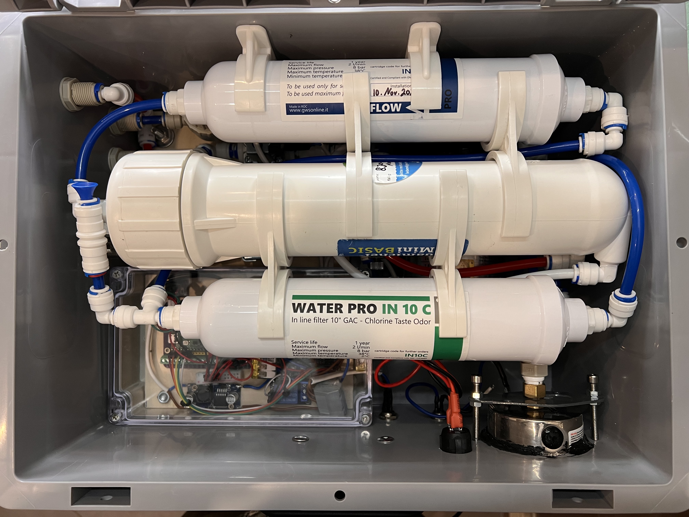

# Reverse Osmosis Filtration System Control for Raspberry Pi Pico

## Program Summary

This script is designed for a Raspberry Pi Pico running [MicroPython](https://micropython.org/) 
(yet should be compatible with other platforms running MicroPython), 
with the goal of controlling a set of 4 valves and a pump for a reverse osmosis filtration system. 
The system is controlled with one button and offers the following main features:

- Automatic flushing of the osmosis membrane every few hours to prevent germ development in the filters.
- Automatic disposal of the first filtered water (which contains more particles due to the lowered pressure in the osmosis membrane during idle time).
- Setting a fixed time interval for water filtration to yield a specific amount of water, which can be stored via a long button press.

The script is structured to be asynchronous, allowing it to handle multiple operations efficiently without blocking the main execution flow.

My final system looked like shown in the following two images:

## Schema

Here is the overview of how the valves are used in the filtration process. (The valve numbering is from the original repository and changed in my code - see pictures above.)

## Hardware parts

For the full system, I used the following hardware parts:
- A reverse osmosis system such as the [Aquamichel Mini](https://www.lebendiges-trinkwasser.shop/shop/aquamichel-mini-teileset/)
- [A self-priming pump 24V](https://www.lebendiges-trinkwasser.shop/shop/pumpe-selbstsaugend-24v-dc/)
- A [pressure gauge](https://www.tooler.de/catalog/product/view/id/263682/) or [this pressure gauge](https://fittingstore.de/products/einbaumanometer-mit-dreikant-frontring-waagerecht) and other connectors for the pump threads etc.
- 24V power supply - I used the [24V 3A Power Supply AveyLum Power](https://amzn.eu/d/cPehZDK)
- A portable box for the whole system to carry and use in a camper etc - I used the [Eurobox NextGen Portable Transport Case, 400 x 300 x 185 mm](https://amzn.eu/d/fMdq8dy)

- Raspberry Pi Pico (or other platform running MicroPython) - I used [Ingcool Pre-soldered Raspberry Pi Pico Board](https://amzn.eu/d/3YGQunV)
- 4 valves for controlling water flow - I used [Solenoid Valve 1/4" DC 24V N/C Normally Closed](https://amzn.eu/d/3zT5nzD) by Gredia.
- Relais module for controlling the valves - I used the [4 channel DC 5V relais module](https://amzn.eu/d/0UkmHZb) by ELEGOO.
- Relais module for controlling the pump - I used the [1-relay, 5V, KY-019 Parent relay](https://amzn.eu/d/h1QWOz9) by AZDelivery.
- Button for user interaction - I used a [simple button](https://amzn.eu/d/iUaOajc).
- Buzzer for audio feedback - I used the [KY-006 Passive Piezo Buzzer](https://amzn.eu/d/e9L0oB6) by AZDelivery.
- DC-DC Step-down converter module to provide the correct voltage for the Raspberry Pi Pico (taking it from the 24V power supply) - I used the [LM2596S DC-DC Power Supply Adapter Step Down](https://amzn.eu/d/2kVXOn0) by AZDelivery.
- A Raspberry Pi Pico Screw Expansion Board - I used the [GPIO Expansion Board](https://amzn.eu/d/49239PA).
- A suitable case - I used the waterproofed [Transparent 200 x 120 x 56 Industrial Housing IP66](https://amzn.eu/d/aowSbms) along with a thin wooden plate on which I could mount the modules to with screws.
- [1/4" tubes and connectors](https://amzn.eu/d/1vY9WBC).

## Configuration

The script uses a configuration file (`config.json`) for various timing operations. 
You can modify these settings in the configuration file to adapt the system to your specific requirements. 
The file is created if it does not exist. It is persistently stored on the Raspberry Pi Pico.

The file contains the following parameters:
- `pre_flush_sec`: Time in seconds for the pre-flush operation of the membrane.
- `post_flush_sec`: Time in seconds for the post-flush operation of the membrane.
- `disposal_sec`: Time in seconds for the disposal operation of the first filtered water.
- `filter_sec`: Time in seconds for the filter operation.
- `auto_flush_sec`: Time in seconds between automatic flushing (Default 8 hours).
- `water_clean_sec`: Time in seconds for water cleaning operation.
- `buzzer_frequency`: Frequency in Hz for the buzzer tone.
- `pump_switch_delay`: Time in milliseconds to delay pump switch actions before/after valves.

## Usage

To use the script:

1. Ensure you have a Raspberry Pi Pico connected to the necessary hardware components (valves, button, buzzer, pump).
2. Upload the script to your Raspberry Pi Pico running MicroPython.
3. Optionally: Adapt the configuration with your desired timing settings.
4. The system will perform automatic flushing, water disposal, and filtration based on your configuration.

## Button Controls

- Short press: Initiates water filtration for the configured duration.
- Long press: Initiates a long water filtration process (of 1 hour).
- During filtration:
    - Short press: Stops the filtration process.
    - Long press: Stops the filtration process and saves the fitration time as new filtration interval to the configuration file.
- During flushing:
  - Skipps the flushing process and goes straight to filtration.

## License

This project is licensed under the GNU Public License v3 - see the [LICENSE](LICENSE) file for details.
