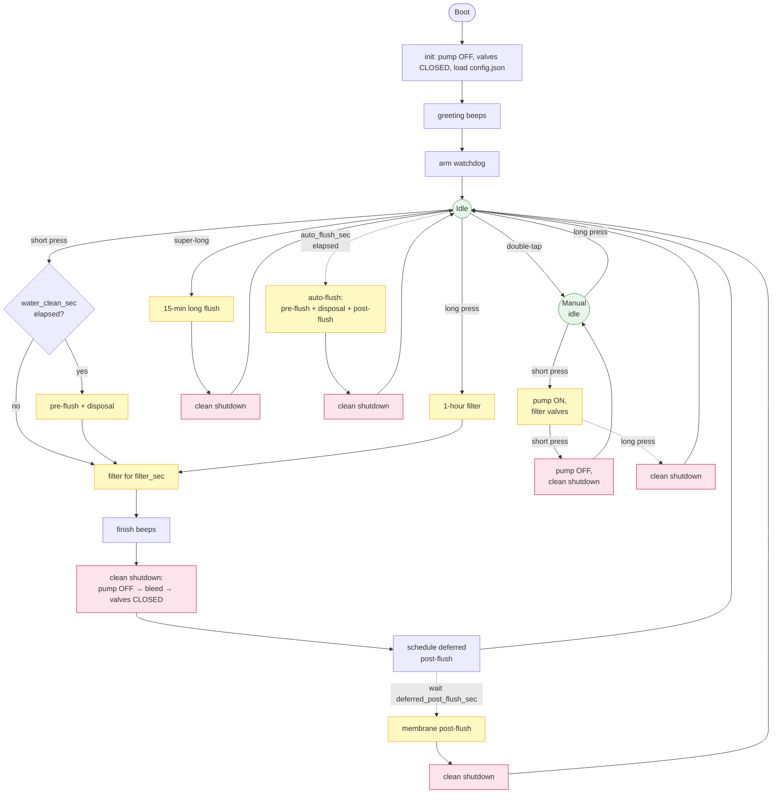
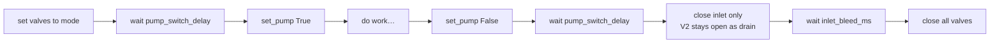

# Controller process flow

This is the source of truth for the process-flow diagram embedded in the
[README](../README.md). Edit it here, paste the rendered version into the README,
or convert to PNG with the Mermaid CLI:

```bash
npx -p @mermaid-js/mermaid-cli mmdc -i docs/flowchart.md -o images/flowchart.png
```

## Top-level flow



Legend:

- **Green nodes** — resting states (idle, manual idle).
- **Yellow nodes** — operating phases (pump on, water moving).
- **Pink nodes** — clean-shutdown phases (pump off, valves bleeding then closing).
- **Solid arrows** — user-initiated transitions.
- **Dashed arrows** — timer-driven transitions (auto-flush timer, deferred post-flush timer, long-press exit from manual mode while pump is on).

## Pump/valve sequencing detail

Every cycle that runs the pump follows the same start/stop ordering invariants.
This subdiagram shows them explicitly because they're load-bearing for hardware
safety:



- Valves open BEFORE the pump turns on, never the other way around.
- The pump turns OFF before any valve change at the end.
- A bleed window (≥ pump_switch_delay + inlet_bleed_ms) sits between pump-OFF
  and all-valves-closed so residual pressure can escape through V2.
- This logic lives in `_clean_shutdown()` and is invoked from the `finally`
  block of every flow coroutine — cancellation cannot bypass it.
